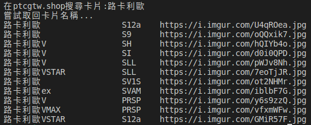
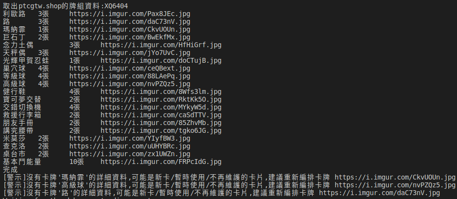
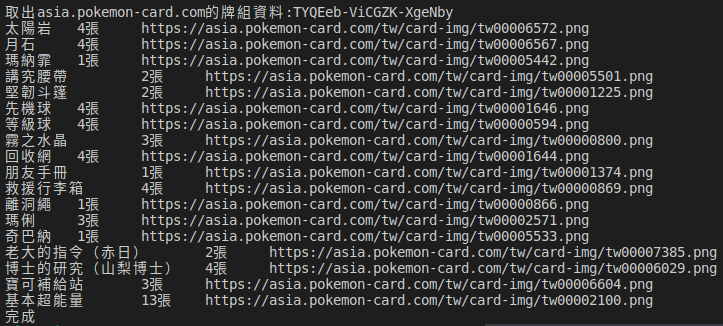

# 取得PTCG牌組與卡片

## 運行需求

需要先安裝node.js

開發機使用版本是
1. node是v16.17.1
1. npm是8.15.0

## 安裝&運行

```bash
npm install # 安裝相依性
npm start # 運行
```

## 功能指令範例

1. 搜尋卡片

    `npm start -- -s '路卡利歐'`

    

2. 下載牌組資料與卡片

    `npm start -- -d XQ6404`

    

3. 下載官方牌組資料與卡片

    `npm start -- -a TYQEeb-ViCGZK-XgeNby`

    
